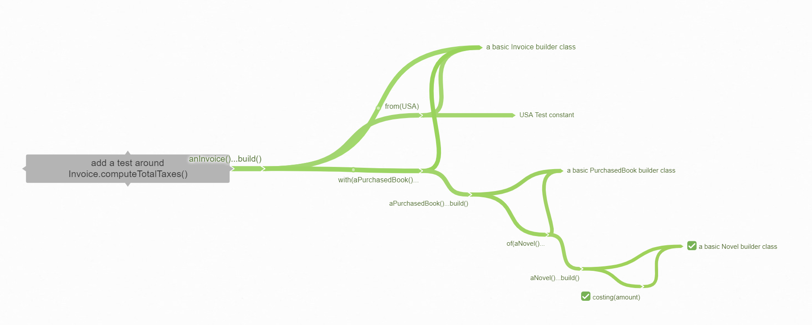

# Mikado Method to the rescue


Test Data Builders make writing new tests faster once you have them.
Unfortunately, they take even longer to write in the first place!

That's not going to help us to test our bugs in legacy code! 

## Present the Mikado Method

The [Mikado Method](./references/The%20Mikado%20Method.md) is a technique to
incrementally do large refactorings, alongside feature delivery.

You'll find resource about the Mikado Method 
[here](./references/The%20Mikado%20Method.md) or on your room walls.

### Rapid Response Question

> As a group, what are the top 5 most important things about the the Mikado
> Method?

## Live code the beginning of the Mikado Graph here

To help you to get started, here is a demo of how to use the Mikado Method in
our particular situation.

[](https://www.youtube.com/watch?v=2wIb8kdxay4&feature=youtu.be)

Below is a screen-shot of the Mikado Graph from the video: 
 

### Code Snippets 

<details>
  <summary>Code of InvoiceTest from the video</summary>
  
```java
package com.murex.tbw.purchase;

import org.junit.jupiter.api.Assertions;
import org.junit.jupiter.api.Test;

class InvoiceTest {

    @Test
    public void
    applies_tax_rules_when_computing_total_amount() {
        Invoice oneNovelUSAInvoice = anInvoice()
                .from(USA)
                .with(aPurchasedBook().of(
                        aNovel().costing(2.99))).build();

        Assertions.assertEquals(2.99 * 1.15 * 0.98, oneNovelUSAInvoice.computeTotalAmount());
    }
}
```

</details>

<details>
  <summary>Code of NovelTestBuilder from the video</summary>
  
```java
package com.murex.tbw.domain.book;
import com.murex.tbw.domain.country.Language;
import java.util.ArrayList;

public class NovelTestBuilder {
    private double price = 3.99;

    public  NovelTestBuilder costing(double price){
        this.price = price;
        return this;
    }

    public Novel build() {
        return  new Novel("Grapes with Wrath", 3.99, null, Language.ENGLISH, new ArrayList<>());
    }
}
```

</details>  

## DIY

Now that you have a better idea, grab a whiteboard, a marker, some post-its and
start creating your own mikado graph to add a test.


### Delete the tests

In real life, you would

1. Fix the bugs
2. Start the mikado method to add a test with data builders

So let's delete the tests!

### Use Mikado Method to create Test Data Builders to add a test on Invoice

We'll first focus on the test on
[Invoice](../src/main/java/com/murex/tbw/purchase/Invoice.java). It's simpler
and achievable given the time we have.

Write your test as if you had the builders, and start to draw your mikado
graph.

Make sure your project keeps building all the time. Notice every time you have
something useful.

### Use Mikado Method to create Test Data Builders to add a test on Report Generator (advanced)

If you have the time, repeat the same exercise with the test on 
[ReportGenerator](../src/main/java/com/murex/tbw/report/ReportGenerator.java)

You should be able to re-use many builders you wrote before.

You might need to look for 
[other flavors of builders](./references/Test%20Data%20Builders.md) to finish
this test.

## Retrospective

Let's do a more thorough retrospective this time.

1- Take a few minutes to write 1 or 2 paragraphs to answer this question:

> For you, what are the most important concepts and insights from this
> training? How do you plan to use what you’ve learned?

2- Read it to your pair, and discuss

3- If you want, volunteer to share it with everyone

4- You can also check what people usually say in
[Animation Guide.md](./Animation%20Guide.md)

----
[Continue...](./5%20-%20Conclusion.md)