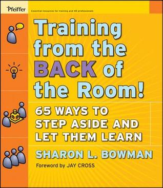

# Animation Guide

Here are information to run this workshop.

## Retrospectives

Here are the topics that usually come up during mini-retros

### 2 - Easy Fix, Difficult Test

| The good                   | The bad                                      |
|----------------------------|----------------------------------------------|
| We managed to fix and test | We see a lot of duplication in the tests     |
|                            | Tests took more time to write than the fixes |
|                            | Rollback was painful                         |
|                            | Minimal Coverage                             |
|                            | Tests are ugly                               |

What issues did you face while writing your tests?  
Do you face the same problems with your existing legacy code?    
How can you tackle those problems to avoid having them in the future?  

### 3 - Building Test Data

| The good                            | The bad                                        |
|-------------------------------------|------------------------------------------------|
| Tests are more readable             | Writing the test data builders is even slower  |
| Less duplication in tests           | Not sure how to apply this in other code bases |
| Would make adding new tests easier  |                                                |

What issues did you face while writing your tests with Test Data Builders?  
How can you compare this approach of writing tests to the previous section?   

### 4 - Mikado Method to the Rescue

Here is the typical feedback about combining the mikado method and test data
builders.

| The good                                      | The bad                           |
|-----------------------------------------------|-----------------------------------|
| Tests are more readable                       | Test for the bug is postponed     |
| Less duplication in tests                     | Cyclic dependencies remain tricky |
| Testability increases at every step           |                                   |
| People are more likely to add tests           |                                   |
| People are more likely to improve the builders|                                   |
| You don't need full-fledged builders to start |                                   |
| It can become viral!                          |                                   |
| Avoids mocks                                  |                                   |

What issues did you face while writing your tests by following the Mikado Method?     
How can you compare this approach of writing tests to the previous 2 sections?     
Can you use this method with your team?   

Ideas to apply this in your daily work: 
* Stick test mikado graphs on the wall, so that everyone can contribute
* Use and online mind-map software and share it with the team (especially with 
a remote team)
* Try it on the next bug you have to deal with, while pairing with a buddy
* Try [mob programming](https://en.wikipedia.org/wiki/Mob_programming), to quickly
  agree on a shared way of working

## Time Table

Here is a typical time table to make the workshop stick in 2 hours and 30
minutes. With this length, tests and work on ReportGenerator is a 'bonus'
depending on the time we have. With a bit more time, it could become a
standard part of the workshop.

### 1 - Introduction (5 minutes)

| Phase | Length | Start | End |
|-------|--------|-------|-----|
| Present the learning goal | 2 | 0 | 2 |
| Energizer | 3 | 2 | 5 |
	
### 2 - Easy Fix, Difficult Test (50 minutes)

| Phase | Length | Start | End |
|-------|--------|-------|-----|
| Present the code and the exercise | 10 | 5 | 15 |
| In pairs, fix the bugs | 10 | 15 | 25
| Rollback Invoice, write a test and fix, same with ReportGenerator (bonus) | 25 | 25 | 50 |
| Mini retro | 5 | 50 | 55 |

----

### 5 minutes break!

----
	
### 3 - Building Test Data (25 minutes)

| Phase | Length | Start | End |
|-------|--------|-------|-----|
| Present test data builders | 10 | 55 | 65 |
| Let them try to use in InvoiceTest | 10 | 65 | 75 |
| Mini retro | 5 | 75 | 80 |
	
### 4 - Mikado Method to the Rescue (60 minutes)

| Phase | Length | Start | End |
|-------|--------|-------|-----|
| Present Mikado graph | 10 | 80 | 90 |
| Live code beginning of Mikado | 10 | 90 | 100 |
| Delete tests, and use 2 techniques to add InvoiceTest, continue on ReportGeneratorTest (bonus) | 25 | 100 | 130 |
| Mini retro | 10 | 130 | 140 |
	
### 5 - Conclusion (10 minutes)

| Phase | Length | Start | End |
|-------|--------|-------|-----|
| Conclusion | 5 | 140 | 145 |
| Q&A | 5 | 145 | 150 |
	
## Pedagogy

We are trying to maximize self-learning as much as possible in this workshop.
That's why there is a lot of time reserved for coding. We also borrowed
techniques from [Training from the Back of the Room](https://www.goodreads.com/book/show/8141935-training-from-the-back-of-the-room)

### Turn and talk Energizer

People will need to pair for programming, so it's a good icebreaker to get them
to meet and discuss the topic at the beginning

### Rapid Response during Lectures

After presenting the Test Data Builders and the Mikado Method, we'll ask some
questions to the attendees to check their understanding. It will also help them
to assess what they learned after programming.

### Wall and Web centers

This collection of markdown files contains 2 'Web Centers':
* [Test Data Builders](./references/Test%20Data%20Builders.md)
* [The Mikado Method](./references/The%20Mikado%20Method.md)

These are web pages where attendees can look for clues as to how to get through
the exercise.

If you are running the workshop in a room, you can create physical Wall Centers
with real copies of books, and printouts of articles
* [The Mikado Method](https://www.goodreads.com/book/show/17974534-the-mikado-method)
* [Growing Object-Oriented Software, Guided by Tests](https://www.goodreads.com/book/show/4268826-growing-object-oriented-software-guided-by-tests?from_search=true)
* [Working Effectively with Legacy Code](https://www.goodreads.com/book/show/44919.Working_Effectively_with_Legacy_Code?ac=1&from_search=true)
* ...

### Pair programming

Will act as a kind of 'Paired Teach Back' activity all along.

### Stand and Talk for Mini-Retros

Mini retros start by asking a simple question like "What worked well and what
did not". This will make the attendees think before they can state their answer
in front of all the class. Following on with other insightful questions will
help them to envision how to use their new knowledge.

### Learning logs as a Conclusion

By writing down what they think they can do with their new knowledge, attendees
have a higher chance of actually using it in their daily work.

## General Animation tips

### Do a live demo of the mikado beginning for large audience

If attendees are remote, or only a single pair, letting them watch the video is fine. If they are all in the same room though, you'll get a chaos of unsynchronized replays...

We could also just watch it through the main screen

### Use wide visible timers

The workshop follows a particular narrative. It is very important to stick to the agenda. Time lost at the beginning is eventually taken from the last activity, which is where people finally 'get' the power of Test Data Builders + Mikado Method.

In order to make sure to stick to the agenda, use wide visible timer in the room. Time-boxing is preferred way to go. Activities don't rely on the code written previously, so people can start the next activity even if they did not finished the previous one. 